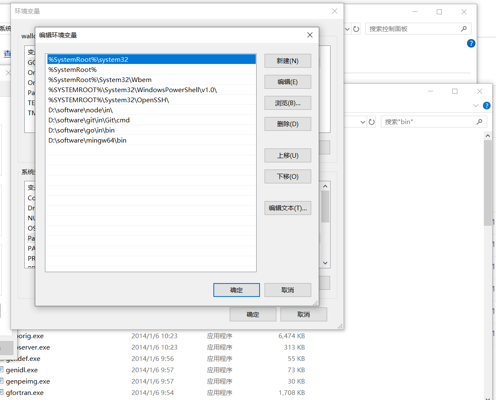
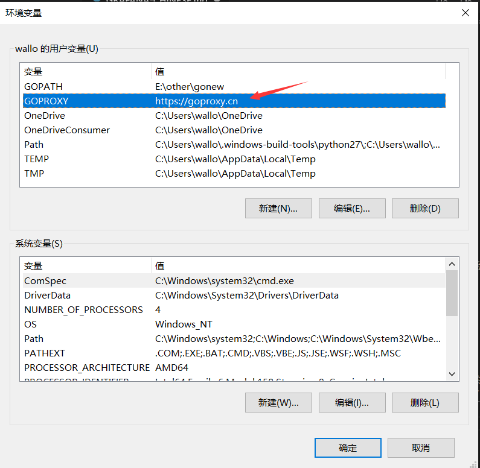
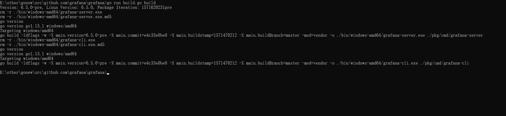
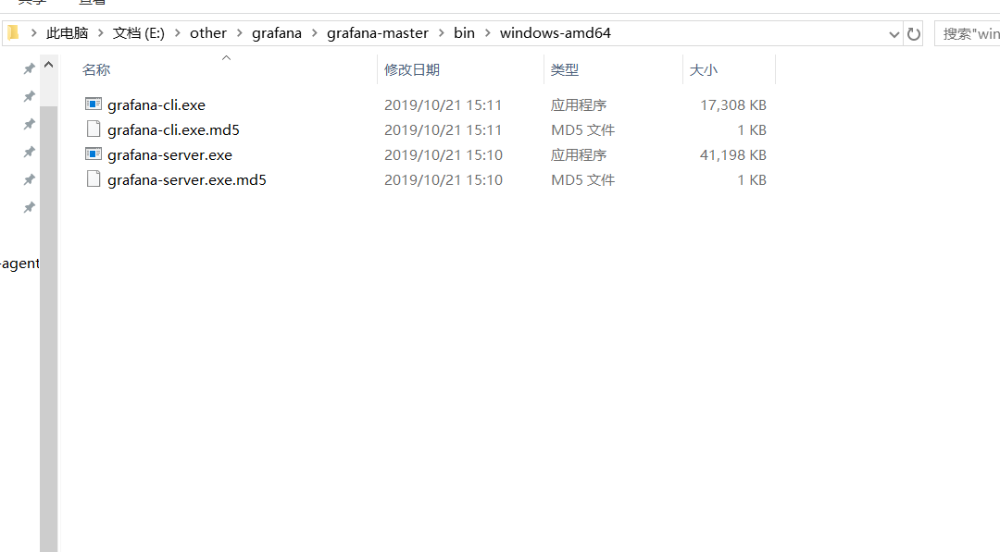
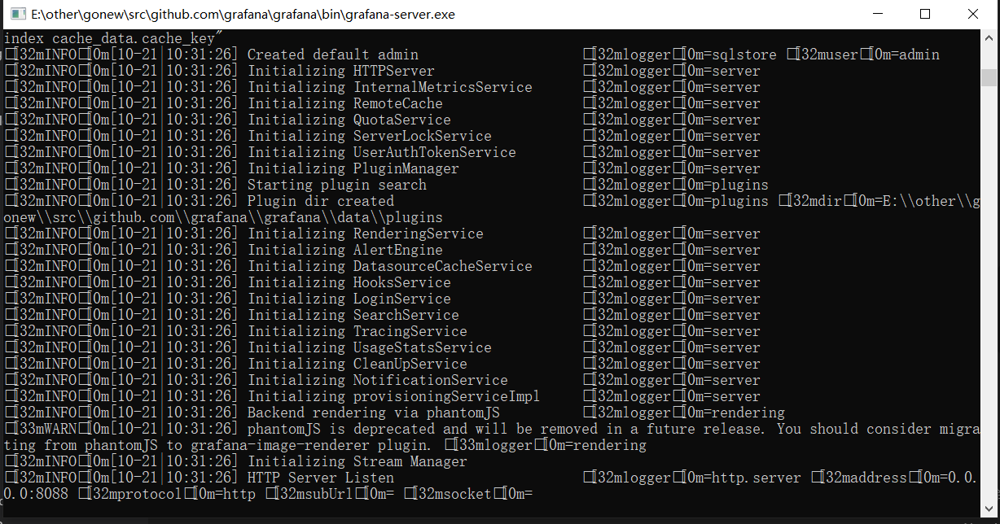
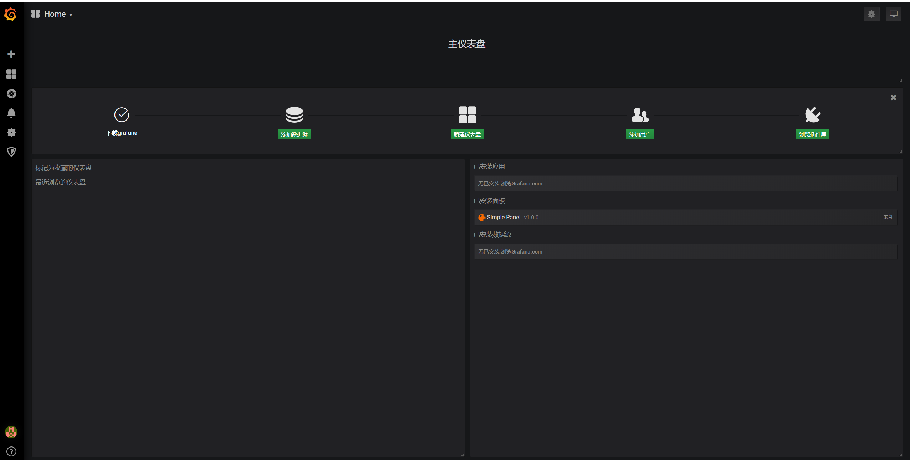
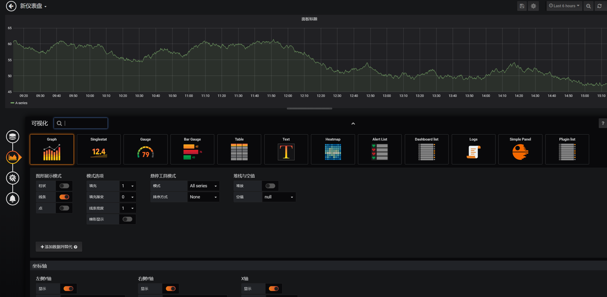

# grafana-chinese
> 此版本对应官方的grafana版本为6.4版本  

从gitlab地址克隆代码之后，我们需要先安装所需要的环境。主要环境有`git`, `node`, `go`。
## 安装软件和配置环境
### 1. 安装go  
去官网下载go之后安装，安装之后输入`go version`验证是否安装正确。因为Grafana后端包括需要GCC编译的Sqlite3。因此，为了在Windows上编译Grafana，您需要安装GCC。
### 2. 下载mingw-w64和node-gyp  
此软件是关于gcc编译所需要的，[点击下载](https://managedway.dl.sourceforge.net/project/mingw-w64/Toolchains%20targetting%20Win64/Personal%20Builds/mingw-builds/4.8.2/threads-posix/seh/x86_64-4.8.2-release-posix-seh-rt_v3-rev2.7z),
下载解压之后将bin加入到环境变量系统变量Path中。这个版本解决有可能出现的64位无法编译的问题。配置示例如下图

使用` npm install -g node-gyp`安装node-gyp
然后在cmd中以管理员运行以下命令
`npm --add-python-to-path='true' --debug install --global windows-build-tools`

### 3. 构建后台
我们先构建一下后台
1. 首先进入我们克隆的grafana-chinese目录下，然后重新设置go的GOPATH
`setx GOPATH %cd%`,运行之后会提示运行成功.
2. 运行`go run build.go setup`命令，等待成功之后进行下一步,当然这一步经常容易失败经常会链接超时，因为https://proxy.golang.org/可能需要翻墙，并且链接也慢，所以我们可以选择配置新的模块代理地址。配置环境变量，如下图：

**当然如果可以成功连接https://proxy.golang.org/并且安装模块那么可以忽略此配置** 

3. 运行`go run build.go build `命令，等待之后会在bin文件夹生成一个文件夹windows-amd64。

文件夹里面有四个文件，启动grafana-server.exe就能启动后台服务，但是我们会发现点击grafana-server.exe后马上就消失了。

**解决方法**
将windows-amd64文件夹下面的四个文件复制然后粘贴到bin问价夹里面，即与windows-amd64文件夹同级
4. 启动后台服务
在启动后台服务之前我们可以先修改一下配置文件，我们在conf文件夹里面配置custom.ini(如果没有的话那么新建一个custom.ini文件，并复制default.ini或者sample.ini的内容)
需要修改的主要配置有
http_port 后台服务启动的端口号,默认为3000
app_mode 如果是开发环境的话可以设置为development
static_root_path 前端静态文件的路径默认为public
如果你想在其他地方开发前端那么就可以更改这个配置。
运行grafana-server.exe
运行之后如下图显示

### 4. 构建前端
接下来需要构建前端，如果没有安装yarn的话需要先安装yarn
1. npm install yarn -g
2. yarn install --pure-lockfile
3. yarn start 
如果yarn install 安装很久或者安装失败可以切换到淘宝镜像
### 5. 预览效果
根据你之前配置的端口号在浏览器中输入localhost:`{port}` 比如localhost:8088，就可以进入系统，默认用户名和密码为localhost,效果如下图所示

